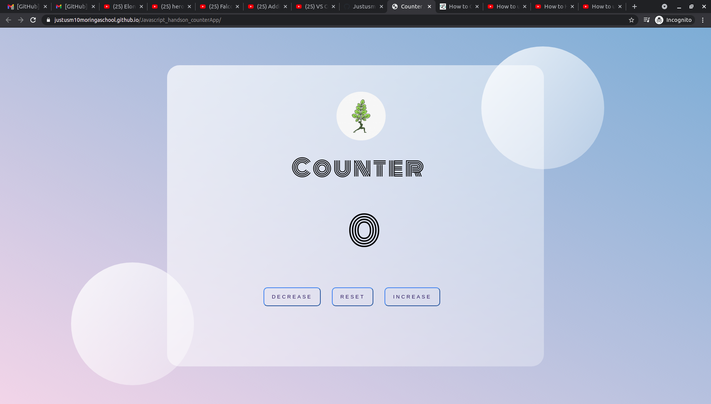

# Counter App

This is a landing page for a Javascript app called counter

## has 3 buttons for Increase, Reset and increase button.

---

### Application Description

---

## Description

This website application runs numbers using decrease and increase button and a reset button to rtun to zero.

---

### Technologies

#### html

#### css

#### javascript

---

 
the general behaviours/functionality of the project is that its intuitive because its direct and doesnt have to open in a new tab.
This website was designed to have little information but just the application to avoid clutter as a design principle..

---

## license

Our License is for public use and the project can be copied.

---

### MIT license

Permission is hereby granted, free of charge, to any person obtaining a copy of this software and associated documentation files (the "Software"), to deal in the Software without restriction, including without limitation the rights to use, copy, modify, merge, publish, distribute, sublicense, and/or sell copies of the Software, and to permit persons to whom the Software is furnished to do so.

---

## Author

Website: https://justusm10moringaschool.github.io/Javascript_handson_counterApp/

Twitter: @justusmo

---

## Contact

0714244366

email: justusm10@gmail.com
